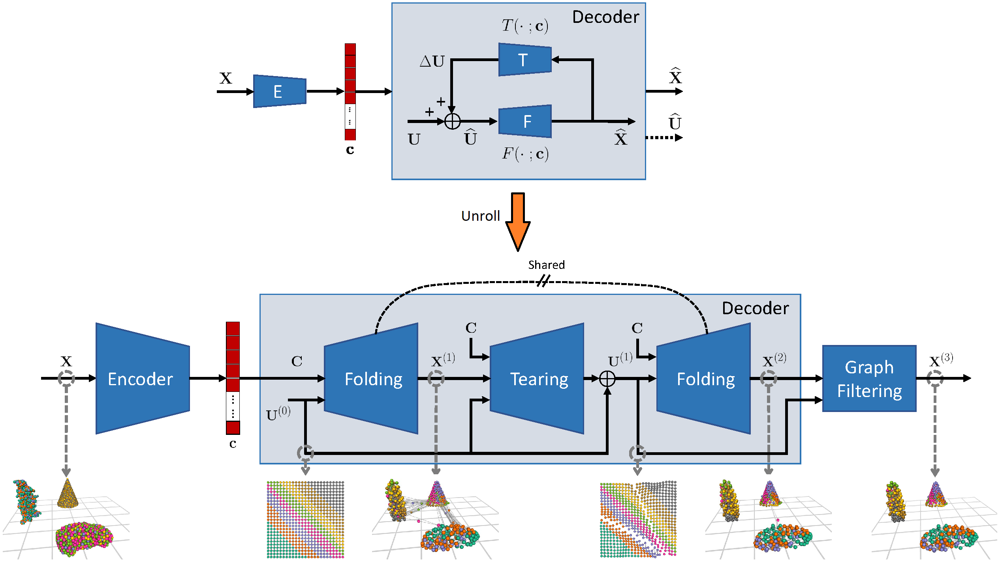

# TearingNet: Point Cloud Autoencoder to Learn Topology-Friendly Representations
Created by Jiahao Pang, Duanshun Li, and Dong Tian from <a href="https://www.interdigital.com/" target="_blank">InterDigital</a>

<p align="center">
    
</p>

## Introduction
This repository contains the implementation of our <a href="https://openaccess.thecvf.com/content/CVPR2021/papers/Pang_TearingNet_Point_Cloud_Autoencoder_To_Learn_Topology-Friendly_Representations_CVPR_2021_paper.pdf" target="_blank">TearingNet</a> paper accepted in CVPR 2021.
Given a point cloud dataset containing objects with various genera, or scenes with multiple objects, we propose the TearingNet, which is an autoencoder tackling the challenging task of representing the point clouds using a fixed-length descriptor.
Unlike existing works directly deforming predefined primitives of genus zero (e.g., a 2D square patch) to an object-level point cloud, our TearingNet
is characterized by a proposed Tearing network module and a Folding network module interacting with each other iteratively.
Particularly, the Tearing network module learns the point cloud topology explicitly.
By breaking the edges of a primitive graph, it tears the graph into patches or with holes to emulate the topology of a target point cloud, leading to faithful reconstructions.

## Installation
* We use Python 3.6, PyTorch 1.3.1 and CUDA 10.0, example commands to set up a virtual environment with anaconda are:
```
conda create tearingnet python=3.6
conda activate tearingnet
conda install pytorch=1.3.1 torchvision=0.4.2 cudatoolkit=10.0 -c pytorch 
```

* Clone our repo to a folder, assume the name of the folder is ``TearingNet``.
* Checkout the <a href=https://github.com/yongheng1991/3D-point-capsule-networks/tree/master/models/nndistance target="_blank">nndistance</a> folder from <a href=https://github.com/yongheng1991/3D-point-capsule-networks target="_blank">3D Point Capsule Network</a>, put it under ``TearingNet/util``, build it according to the instructions of <a href=https://github.com/yongheng1991/3D-point-capsule-networks/blob/master/README.md target="_blank">3D Point Capsule Network</a>.
* We adopt the ShapeNet part data loader from <a href=https://github.com/yongheng1991/3D-point-capsule-networks target="_blank">3D Point Capsule Network</a>. Checkout <a href=https://github.com/yongheng1991/3D-point-capsule-networks/blob/master/dataloaders/shapenet_part_loader.py>shapenet_part_loader.py</a> and put it under the ``TearingNet/dataloaders``.
* Install the <a href=https://github.com/lanpa/tensorboardX target="_blank">TensorboardX</a>, <a href=https://github.com/intel-isl/Open3D target="_blank">Open3D</a> and the <a href=https://www.h5py.org/ target="_blank">h5py</a> packages, example commands are:
```
conda install -c open3d-admin open3d
conda install -c conda-forge tensorboardx
conda install -c anaconda h5py
```

## Data Preparation

### KITTI Multi-Object Dataset

* Our KITTI Multi-Object (KIMO) Dataset is constructed with <a href=https://github.com/3bobo/PCDet/blob/95d2ab5e9c9acf8e9de8eba0d31fb161fc30221b/pcdet/datasets/kitti/kitti_dataset.py target="_blank">kitti_dataset.py</a> of <a href=https://github.com/3bobo/PCDet/tree/95d2ab5e9c9acf8e9de8eba0d31fb161fc30221b target="_blank">PCDet (commit 95d2ab5)</a>. Please clone and install <a href=https://github.com/3bobo/PCDet/tree/95d2ab5e9c9acf8e9de8eba0d31fb161fc30221b target="_blank">PCDet</a>, then prepare the KITTI dataset according to their instructions.
* Assume the name of the cloned folder is ``PCDet``, please replace the ``create_groundtruth_database()`` function in ``kitti_dataset.py`` by our modified one provided in ``TearingNet/util/pcdet_create_grouth_database.py``.
* Prepare the KITTI dataset, then generate the data infos according to the instructions in the <a href=https://github.com/3bobo/PCDet/tree/95d2ab5e9c9acf8e9de8eba0d31fb161fc30221b#readme target="_blank">README.md</a> of <a href=https://github.com/3bobo/PCDet/tree/95d2ab5e9c9acf8e9de8eba0d31fb161fc30221b target="_blank">PCDet</a>.
* Create the folders ``TearingNet/dataset`` and ``TearingNet/dataset/kittimulobj`` then put the newly-generated folder ``PCDet/data/kitti/kitti_single`` under ``TearingNet/dataset/kittimulobj``. Also, put the newly-generated file ``PCDet/data/kitti/kitti_dbinfos_object.pkl`` under the ``TearingNet/dataset/kittimulobj`` folder.
* Instead of assembling several single-object point clouds together and write down as a multi-object point cloud, we generate the parameters that parameterize the multi-object point clouds then assemble them on the fly during training/testing. To obtain the parameters, run our prepared scripts as follows under the ``TearingNet`` folder. These scripts generate the training and testing splits of the KIMO-5 dataset:
```
./scripts/launch.sh ./scripts/gen_data/gen_kitti_mulobj_train_5x5.sh
./scripts/launch.sh ./scripts/gen_data/gen_kitti_mulobj_test_5x5.sh
```
* The file structure of the KIMO dataset after these steps becomes:
```
kittimulobj
      ├── kitti_dbinfos_object.pkl
      ├── kitti_mulobj_param_test_5x5_2048.pkl
      ├── kitti_mulobj_param_train_5x5_2048.pkl
      └── kitti_single
              ├── 0_0_Pedestrian.bin
              ├── 1000_0_Car.bin
              ├── 1000_1_Car.bin
              ├── 1000_2_Van.bin
              ...
```

### CAD Model Multi-Object Dataset

* Create the ``TearingNet/dataset/cadmulobj`` folder to hold the CAD Model Multi-Object (CAMO) dataset.

* Our CAMO dataset is based on the CAD models of "person", "car", "cone", "plant" from ModelNet40, and "motorbike" from the ShapeNetPart dataset. Use the scripts <a href=https://github.com/yongheng1991/3D-point-capsule-networks/blob/master/dataset/download_shapenet_part16_catagories.sh target="_blank">download_shapenet_part16_catagories.sh</a> and <a href=https://github.com/yongheng1991/3D-point-capsule-networks/blob/master/dataset/download_modelnet40_same_with_pointnet.sh target="_blank">download_modelnet40_same_with_pointnet.sh</a> from <a href=https://github.com/yongheng1991/3D-point-capsule-networks target="_blank">3D Point Capsule Network</a> to download these two datasets, then orgainze them according to the following file structure under the ``TearingNet/dataset`` folder:
```
dataset
    ├── cadmulobj
    ├── kittimulobj
    ├── modelnet40
    │       └── modelnet40_ply_hdf5_2048
    │                   ├── ply_data_test0.h5
    │                   ├── ply_data_test_0_id2file.json
    │                   ├── ply_data_test1.h5
    │                   ├── ply_data_test_1_id2file.json
    │                   ...
    └── shapenet_part
            ├── shapenetcore_partanno_segmentation_benchmark_v0
            │   ├── 02691156
            │   │   ├── points
            │   │   │   ├── 1021a0914a7207aff927ed529ad90a11.pts
            │   │   │   ├── 103c9e43cdf6501c62b600da24e0965.pts
            │   │   │   ├── 105f7f51e4140ee4b6b87e72ead132ed.pts
            ...
```
* Extract the "person", "car", "cone" and "plant" models from ModelNet40, and the "motorbike" models from the ShapeNet part dataset, by running the following Python script under the ``TearingNet`` folder:
```
python util/cad_models_collector.py
```
* The previous step generates the file ``TearingNet/dataset/cadmulobj/cad_models.npy``, based on which we generate the parameters for the CAMO dataset. To do so, launch the following scripts:
```
./scripts/launch.sh ./scripts/gen_data/gen_cad_mulobj_train_5x5.sh
./scripts/launch.sh ./scripts/gen_data/gen_cad_mulobj_test_5x5.sh
```
* The file structure of the CAMO dataset after these steps becomes:
```
cadmulobj
    ├── cad_models.npy
    ├── cad_mulobj_param_test_5x5.npy
    └── cad_mulobj_param_train_5x5.npy
```
## Experiments

### Training

We employ a two-stage training strategy to train the TearingNet. The first step is to train a FoldingNet (E-Net & F-Net in paper). Take the KIMO dataset as an example, launch the following scripts under the ``TearingNet`` folder:
```
./scripts/launch.sh ./scripts/experiments/train_folding_kitti.sh
```
Having finished the first step, a pretrained model will be saved in ``TearingNet/results/train_folding_kitti``. To load the pretrained FoldingNet into a TearingNet configuration and perform training, launch the following scripts:
```
./scripts/launch.sh ./scripts/experiments/train_tearing_kitti.sh
```
To see the meanings of the parameters in ``train_folding_kitti.sh`` and ``train_tearing_kitti.sh``, check the Python script ``TearinNet/util/option_handler.py``.
### Reconstruction

To perform the reconstruction experiment with the trained model, launch the following scripts:
```
./scripts/launch.sh ./scripts/experiments/reconstruction.sh
```
One may write down the reconstructions in PLY format by setting a positive ``PC_WRITE_FREQ`` value. Again, please refer to ``TearinNet/util/option_handler.py`` for the meanings of individual parameters.
### Counting

To perform the counting experiment with the trained model, launch the following scripts:
```
./scripts/launch.sh ./scripts/experiments/counting.sh
```

## Citing this Work
Please cite our work if you find it useful for your research:
```
@inproceedings{pang2021tearingnet, 
    title={TearingNet: Point Cloud Autoencoder to Learn Topology-Friendly Representations}, 
    author={Pang, Jiahao and Li, Duanshun, and Tian, Dong}, 
    booktitle={IEEE Conference on Computer Vision and Pattern Recognition (CVPR)}, 
    year={2021}
}
```

## Related Projects
* <a href=https://github.com/yongheng1991/3D-point-capsule-networks target="_blank">3D Point Capsule Networks</a>
* <a href=https://github.com/ThibaultGROUEIX/AtlasNet target="_blank">AtlasNet</a>
* <a href=https://github.com/TheoDEPRELLE/AtlasNetV2 target="_blank">AtlasNetV2</a>

* <a href=https://github.com/3bobo/PCDet/tree/95d2ab5e9c9acf8e9de8eba0d31fb161fc30221b/pcdet target="_blank">PCDet</a>

<p align="center">
     
</p>